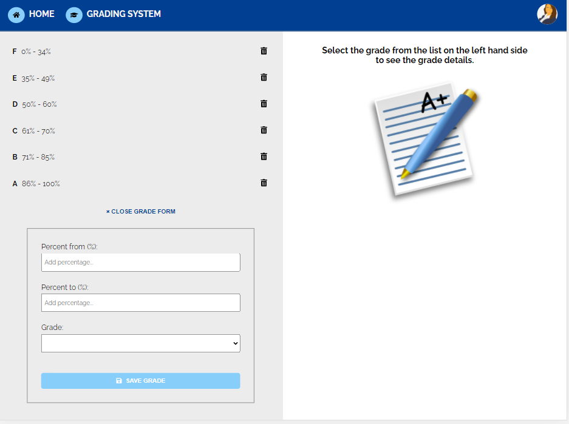
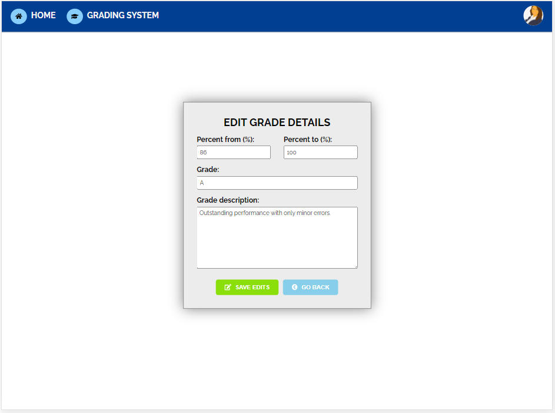

# Grading System App

This project was generated with [Angular CLI](https://github.com/angular/angular-cli) version 11.2.12.

## Tech Stack:

⭐ Angular

⭐ JavaScript (TypeScript)

⭐ CSS (SCSS)

⭐ HTML

⭐ Font Awesome

⭐ JSON-Server (as a mock back-end)

## Features

✔️ Displaying the list of grades sorted according to the minimum percentage grade

✔️ Detailed display of a grade when clicking on the item from the list

✔️ Edition of the grade details

✔️ Removing a sepecific item from the list of grades

✔️ Toggling the display of the add new grade form

✔️ Adding a new grade to the list of grades

## App Views

View with the grades list and a form to add a new grade:

Editable grade details view:

## Setup

Run `ng serve` for a dev server. Navigate to `http://localhost:4200/`. 

The app will automatically reload if you change any of the source files.

Also, run `npm run server` to watch the db.json file for the data changes.
